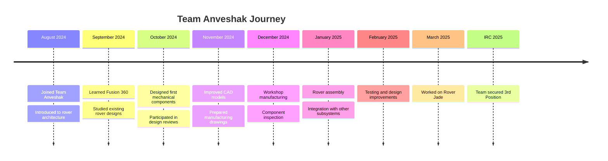

# Project Timeline

```mermaid
timeline
    title Team Anveshak Journey

    August 2024 : Joined Team Anveshak
                : Introduced to rover architecture

    September 2024 : Learned Fusion 360
                   : Studied existing rover designs

    October 2024 : Designed first mechanical components
                 : Participated in design reviews

    November 2024 : Improved CAD models
                  : Prepared manufacturing drawings

    December 2024 : Workshop manufacturing
                  : Component inspection

    January 2025 : Rover assembly
                 : Integration with other subsystems

    February 2025 : Testing and design improvements

    March 2025 : Worked on Rover Jade

    IRC 2025 : Team secured 3rd Position
```
