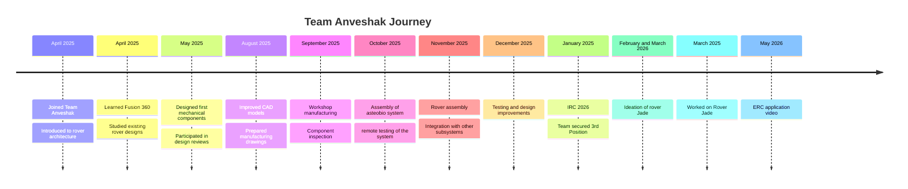

# Project Timeline

```mermaid
timeline
    title Team Anveshak Journey

    April 2025 : Joined Team Anveshak
                : Introduced to rover architecture

  April 2025 : Learned Fusion 360
                   : Studied existing rover designs

   May 2025 : Designed first mechanical components
                 : Participated in design reviews

  August 2025 : Improved CAD models
                  : Prepared manufacturing drawings

  September 2025 : Workshop manufacturing
                  : Component inspection
October 2025: Assembly of asteobio system
            : remote testing of the system

November 2025 : Rover assembly
                 : Integration with other subsystems

December 2025 : Testing and design improvements

January 2025: IRC 2026
                 : Team secured 3rd Position

February and March 2026: Ideation of rover Jade

 March 2025 : Worked on Rover Jade

May 2026: ERC application video

    
```

